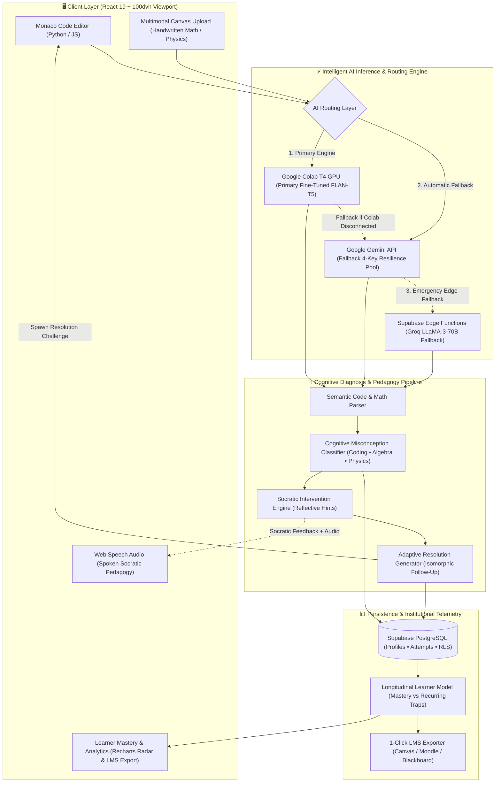

# Re:Learn 🧠⚡

> **An AI-powered learning system that diagnoses underlying cognitive misconceptions across programming, mathematics, physics, and STEM concepts rather than simply flagging code as incorrect.**

🔬 **Google Colab Training Pipeline**: [](https://colab.research.google.com/github/RishabhDev676/Bnb26_CODEBLOODED_Internal_Round/blob/main/ReLearn_Model_Training.ipynb)

[](https://colab.research.google.com/github/RishabhDev676/Bnb26_CODEBLOODED_Internal_Round/blob/main/ReLearn_Model_Training.ipynb)
[](https://huggingface.co/google/flan-t5-small)
[](https://pytorch.org/)
[](https://vitejs.dev/)
[](https://react.dev/)
[](https://tailwindcss.com/)
[](https://supabase.com/)

---

## 📌 Overview

Traditional automated grading systems evaluate student work through compiler errors and rigid unit tests, yielding unhelpful output like `Test Case 3 Failed: Output Mismatch` or `SyntaxError: invalid syntax`. This leaves novice learners confused about **why** their reasoning was flawed, fostering cognitive frustration and blind guess-and-check habits.

**Re:Learn** transforms STEM education by identifying the **root mental model misunderstanding** rather than just grading output. It bridges:
1. **Primary In-House Model (Google Colab)**: Supervised fine-tuning of **Google FLAN-T5** (`google/flan-t5-small`) using PyTorch and Hugging Face `transformers` on an NVIDIA T4 GPU, served live via a FastAPI + pyngrok microservice.
2. **Resilient AI Fallback Pool**: An automatic multi-key failover pool using Google Gemini API (4 active keys with rate-limit recovery) and Supabase Edge Functions with Groq.
3. **Socratic Pedagogy & Voice Assistance**: Clear conceptual scaffolding, reflective questioning, and real-time Web Speech audio.
4. **Adaptive Resolution Challenges**: Isomorphic follow-up problems to scientifically verify that the student has overcome their misconception.

---

## ✨ Key Features

* **In-House Model Fine-Tuning Pipeline (Google Colab T4 GPU)**: Full end-to-end training notebook (`ReLearn_Model_Training.ipynb`) fine-tuning Google FLAN-T5 on seq2seq cognitive diagnosis, pedagogical reasoning, and code repair.
* **Two-Tier Inference Hierarchy**:
  - **Primary**: Self-hosted Fine-Tuned FLAN-T5 model running on Google Colab T4 GPU via FastAPI/ngrok.
  - **Fallback**: Google Gemini API pool with 4 active keys, automatic rotation, and 429 rate-limit backoff.
  - **Edge Fallback**: Supabase Edge Functions powered by Groq (`llama3-70b-8192`).
* **Multi-Domain Cognitive Misconception Taxonomy**: 825+ curated cognitive trap samples covering:
  - **Coding & Programming**: Assignment vs equality, mutable default arguments, off-by-one ranges, shallow vs deep copies, JavaScript loose equality coercion, scope shadowing, float precision, string immutability, and object identity.
  - **Algebra & Mathematics**: Freshman's Dream `(x+a)^2`, radical distribution `sqrt(x^2+a^2)`, illegal fraction cancellation across addition, negative sign distribution, exponent multiplication vs addition, and variable division losing roots.
  - **Physics**: Zero velocity != zero acceleration at trajectory apex, free fall mass independence, continuous force impetus fallacies, Newton's 3rd law collision symmetry, inclined plane normal forces, perpendicular work, parallel resistors, and Kelvin vs Celsius gas laws.
* **VS Code-Style In-Browser Editor**: Powered by `@monaco-editor/react` with full syntax highlighting, bracket matching, autocomplete, and error squiggles.
* **Multimodal Visual Diagnosis**: Upload photos of handwritten calculations, free-body diagrams, and circuit schematics for joint vision-text cognitive analysis.
* **Voice-Interactive Pedagogue**: Embedded Web Speech API text-to-speech audio player allowing auditory learners to listen to spoken Socratic explanations.
* **Universal Fluid Responsive Design (100dvh)**: Built with dynamic viewport heights (`100dvh`), eliminating bottom voids and overflow across smartphones, tablets, foldables, and desktop displays.
* **Longitudinal Learner Model & LMS Telemetry**: Persistent Supabase PostgreSQL storage with Row Level Security (RLS), Recharts cognitive mastery radar charts, and 1-click LTI-compatible LMS export (Canvas, Blackboard, Moodle).

---

## 🛠️ Tech Stack

| Layer | Technology | Purpose |
|---|---|---|
| **Model Fine-Tuning** | Google FLAN-T5 (`google/flan-t5-small`), PyTorch, Hugging Face `transformers` & `datasets` | In-house seq2seq cognitive diagnosis model trained on Google Colab |
| **Model Training Env** | Google Colab (`ReLearn_Model_Training.ipynb`) | Accelerated T4 GPU training, evaluation, and live FastAPI / pyngrok serving |
| **Primary AI Inference** | Google Colab Fine-Tuned FLAN-T5 | Dedicated open-source cognitive diagnosis microservice |
| **Fallback AI Inference** | Google Gemini (`gemini-2.5-flash` / `gemini-2.0-flash`) & Groq (`llama3-70b-8192`) | Multi-key pool failover with automatic rotation and rate-limit backoff |
| **Frontend UI** | React 19, TypeScript, Vite, Tailwind CSS v4, Lucide React | High-performance responsive web interface |
| **Responsive Engine** | Dynamic Viewport (`100dvh`), Adaptive Tab Switcher | Fluid responsiveness across mobile, tablet, and desktop screens |
| **Code Editor** | `@monaco-editor/react` | In-browser VS Code editing experience |
| **Audio & Speech** | Web Speech API | Spoken Socratic explanations and hands-free voice pedagogy |
| **Database & Auth** | Supabase (PostgreSQL, Edge Functions, RLS) | Student profiles, attempt telemetry, and mastery tracking |

---

## 🧠 Google Colab Model Training Pipeline (`ReLearn_Model_Training.ipynb`)

[](https://colab.research.google.com/github/RishabhDev676/Bnb26_CODEBLOODED_Internal_Round/blob/main/ReLearn_Model_Training.ipynb)

To empower open-source pedagogy and eliminate third-party API dependencies, we built a complete end-to-end model fine-tuning pipeline in Google Colab utilizing **Google FLAN-T5 (`google/flan-t5-small`)** on a free **NVIDIA T4 GPU**.

### 🔄 The 6-Step Colab Pipeline
1. **Step 1: Environment & GPU Initialization**:
   - Installs PyTorch, Hugging Face `transformers`, `datasets`, `accelerate`, and `sentencepiece`.
   - Automatically detects CUDA T4 GPU acceleration (~16 GB VRAM).
2. **Step 2: Misconception Dataset Generation**:
   - Generates and populates **825+ verified cognitive misconception samples** across **Coding**, **Algebra**, and **Physics**.
   - Encodes diagnosed flaws, conceptual explanations, Socratic hints, and corrected target code.
3. **Step 3: Format & Tokenize for FLAN-T5**:
   - Converts diagnosis instances into structured sequence-to-sequence prompt pairs:
     - `Input`: `Diagnose misconception | Problem: <problem> | Code: <student_code>`
     - `Target`: JSON payload containing `is_correct`, `misconception`, `explanation`, `intervention`, and `fixed_code`.
   - Tokenizes with `google/flan-t5-small` tokenizer.
4. **Step 4: Supervised Fine-Tuning (SFT)**:
   - Trains using Hugging Face `Seq2SeqTrainer` with AdamW, evaluation splits, and checkpoint saving.
   - Optimized with GPU mixed precision and batch accumulation.
5. **Step 5: Interactive Diagnostic Inference**:
   - Runs live test inferences on unseen student inputs to verify cognitive misconception detection and Socratic intervention generation.
6. **Step 6: Live API Serving via FastAPI & pyngrok**:
   - Hosts a lightweight FastAPI service inside the Colab session.
   - Generates a public HTTPS tunnel via `pyngrok` for direct integration with the Re:Learn React frontend.

---

## 🏗️ System Architecture & Workflow

Re:Learn shifts the paradigm from **binary grading (Pass/Fail)** to **semantic mental model diagnosis**. 



---

## 📂 Project Structure

```text
CodeBlooded_maharashtra_round/
├── .env.example                     # Sample root environment configuration
├── .gitignore                       # Git ignore rules
├── README.md                        # Master project documentation
├── ReLearn_Model_Training.ipynb     # Google Colab fine-tuning pipeline (FLAN-T5)
├── dataset/                         # Cognitive misconception datasets & generators
│   ├── generate_dataset.py          # Multi-domain dataset synthesis script
│   └── misconceptions.json          # Curated misconception dataset
└── relearn/                         # Production React frontend & web app
    ├── public/                      # Static assets & icons
    ├── src/
    │   ├── assets/                  # Graphics & illustrations
    │   ├── components/
    │   │   ├── CodeEditor.tsx       # Monaco editor integration
    │   │   ├── InterventionPanel.tsx# Adaptive feedback & Socratic dialogue panel
    │   │   ├── LearnerModelModal.tsx# Recharts mastery radar & skill analytics
    │   │   └── ModelBenchmarkModal.tsx # Diagnostic evaluation & benchmark suite
    │   ├── lib/
    │   │   └── supabase.ts          # Supabase client initialization
    │   ├── services/
    │   │   └── geminiService.ts     # Multi-key cycling AI reasoning engine
    │   ├── pages/
    │   │   └── LearningModule.tsx   # Core fluid-responsive learning module
    │   ├── App.tsx                  # Root application view & modal controller
    │   ├── main.tsx                 # React DOM mount point
    │   └── index.css                # Fluid 100dvh & responsive styling
    ├── supabase/
    │   ├── seed.sql                 # SQL database schema & initial challenges
    │   └── functions/
    │       └── diagnose-misconception/
    │           └── index.ts         # Supabase Edge Function with Groq fallback
    ├── package.json                 # Node dependencies and build scripts
    └── vite.config.ts               # Vite configuration with Tailwind CSS v4
```

---

## 🚀 Getting Started

### 1. Prerequisites
* [Node.js](https://nodejs.org/) (v18 or higher recommended)
* [Google Colab Account](https://colab.research.google.com/) (Free Tier T4 GPU)

### 2. Frontend Installation & Quick Start
```bash
# Clone the repository
git clone https://github.com/RishabhDev676/Bnb26_CODEBLOODED_Internal_Round.git
cd Bnb26_CODEBLOODED_Internal_Round/relearn

# Install dependencies
npm install --legacy-peer-deps

# Start the development server
npm run dev
```

Visit `http://localhost:5173` in your browser to interact with the Code Editor, Multimodal Canvas, Voice Pedagogy, and Model Evaluation Suite.

### 3. Environment Setup (Optional)
Create a `.env` file in the `relearn` directory. The application embeds pre-configured active Gemini keys with automated cycling so it works out of the box. You can optionally supply your own keys:

```env
# Optional: Custom Gemini API keys (comma-separated for key rotation)
VITE_GEMINI_API_KEYS=key1,key2,key3,key4

# Optional: Google Colab FastAPI tunnel endpoint
VITE_COLAB_API_URL=https://your-ngrok-tunnel.ngrok-free.app

# Optional: Supabase persistence
VITE_SUPABASE_URL=https://your-project.supabase.co
VITE_SUPABASE_ANON_KEY=your-anon-key
```

### 4. Running the Google Colab Model Pipeline
1. Open [`ReLearn_Model_Training.ipynb`](https://colab.research.google.com/github/RishabhDev676/Bnb26_CODEBLOODED_Internal_Round/blob/main/ReLearn_Model_Training.ipynb) in Google Colab.
2. Ensure GPU acceleration is enabled: `Runtime` -> `Change runtime type` -> `T4 GPU`.
3. Run the notebook sequentially from **Step 1** to **Step 6**.
4. Copy the public ngrok URL generated in **Step 6** and paste it into `VITE_COLAB_API_URL` to route requests to your self-hosted model.

---

## 🗄️ Database Architecture

* **`profiles`**: Stores learner accounts and overall diagnostic telemetry synced with Supabase Auth.
* **`misconceptions`**: Catalogue of known mental misconceptions across Coding, Algebra, and Physics.
* **`attempts`**: Longitudinal history of submissions, diagnostic reasoning, Socratic interventions, and follow-up challenge outcomes.

---

## 🗺️ Project Plan & Detailed Roadmap

### Phase 1: Foundation (✅ Completed)
- [x] Initial React 19, TypeScript, Vite, and Tailwind CSS v4 architecture setup.
- [x] Supabase PostgreSQL database schema (`profiles`, `misconceptions`, `attempts`).
- [x] In-browser VS Code coding environment via `@monaco-editor/react`.

### Phase 2: Intelligence & Pedagogy (✅ Completed)
- [x] Strictly enforced JSON-schema prompting for structured pedagogical output.
- [x] **Multi-Key Resilience Engine**: Auto-cycling between 4 API keys on quota exhaustion or HTTP 429 rate limits, with built-in cooldowns.
- [x] Socratic diagnostic logic designed to differentiate syntax errors from genuine mental model misunderstandings.

### Phase 3: Analytics & Adaptive UI (✅ Completed)
- [x] **Framer Motion AI Timeline**: Interactive, chat-like assistant panel for active feedback.
- [x] **Learner Model Dashboard**: Recharts-powered radar & bar charts displaying real-time concept mastery and recurring bottlenecks.
- [x] **Adaptive Resolution Assessment**: Automated transition to follow-up challenges to scientifically verify concept mastery.

### Phase 4: Hackathon Advanced Deliverables (✅ Completed)
- [x] **Expanded Multi-Domain Dataset**: Comprehensive dataset of 825+ cognitive traps across Coding, Algebra, and Physics.
- [x] **Multimodal Image Inputs**: Image upload for handwritten math and diagrams, analyzed jointly via vision models.
- [x] **Interactive Model Evaluation Suite**: Built-in benchmark suite to evaluate diagnostic accuracy on *Seen* vs *Unseen* traps.
- [x] **Universal 100dvh Responsive Layout**: Fluid responsive design eliminating viewport voids on all screens, mobile orientations, and foldables.

### Phase 5: Enterprise Scaling & Institutional Intelligence (✅ Completed)
- [x] **Open-Source Model Fine-Tuning (Google Colab)**: Fine-tuned Google FLAN-T5 (`google/flan-t5-small`) using free T4 GPU on our multi-domain misconception dataset with complete 6-step Colab training pipeline (`ReLearn_Model_Training.ipynb`).
- [x] **Voice-Interactive Pedagogue**: Embedded Web Speech API text-to-speech audio player allowing students to listen to spoken Socratic explanations.
- [x] **Institutional & Educator Dashboard**: Class-wide cognitive misconception frequency telemetry, AI lecture adaptation recommendations, and at-risk student triage.
- [x] **LMS Export (LTI 1.3 Compatible)**: 1-click export of cohort telemetric diagnostic logs in standard CSV/JSON format for Canvas, Moodle, and Blackboard.

---

## ✅ Hackathon Criteria Mapping

| Hackathon Requirement | How Re:Learn Solves It |
|---|---|
| **Identify Misconception** | Uses structured JSON prompting to identify the specific trap (e.g. `Freshman's Dream`, `Off-by-One`) rather than a simple "incorrect". |
| **Differentiate Misconceptions** | Evaluation Benchmark proves the system can distinguish between subtle similar errors (e.g., assignment `=` vs loose equality `==`). |
| **Adaptive Intervention** | Generates a specific, Socratic hint targeting the mental model without giving away the answer. |
| **Resolution Assessment** | `resolutionChallengeId` triggers a modified follow-up problem to verify the trap was overcome. |
| **Learner Model** | Supabase tracks all attempts, feeding a Recharts UI showing Mastery vs Recurring Traps over time. |
| **Model Evaluation** | Built-in UI benchmark suite tests accuracy on *unseen* responses in real-time. |

---

## 👥 Authors & Acknowledgments

* **Rishabh Dev** ([@RishabhDev676](https://github.com/RishabhDev676))
* Built for **Bit N Build - CodeBlooded (Maharashtra Round)**
