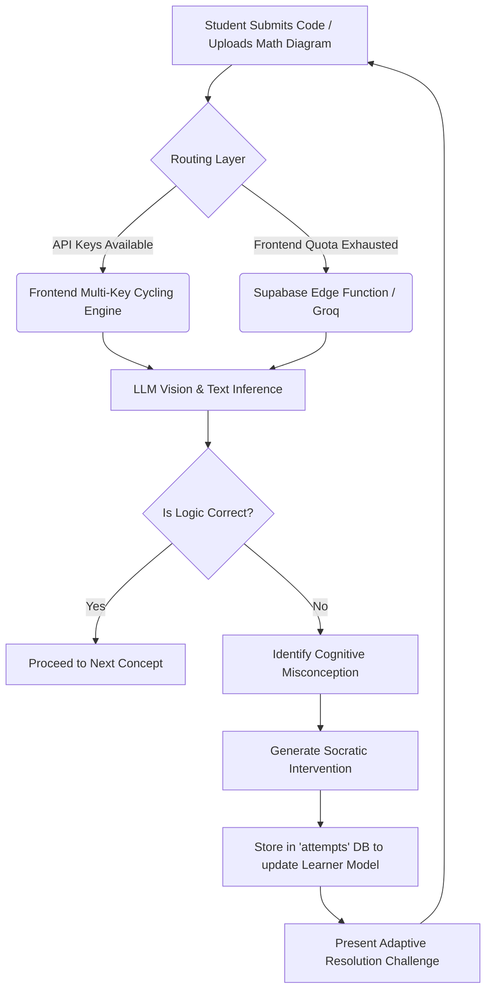

# Re:Learn 🧠⚡

> **An AI-powered learning system that diagnoses underlying programming misconceptions rather than simply flagging code as incorrect.**

[](https://vitejs.dev/)
[](https://react.dev/)
[](https://tailwindcss.com/)
[](https://supabase.com/)
[](https://groq.com/)

---

## 📌 Overview

Traditional automated grading systems typically evaluate student code through unit tests and compiler errors, yielding unhelpful output like `Test Case 3 Failed: Output Mismatch`. This leaves novice programmers confused about *why* their mental model was flawed.

**Re:Learn** is designed for introductory programming learners (Python and JavaScript). It leverages the **Groq API** (powered by `llama3-70b-8192`) and **Supabase Edge Functions** to perform deep semantic analysis on code submissions. It classifies the student's specific cognitive misconception, generates a targeted pedagogical intervention, and follows up with an adaptive resolution challenge.

---

## ✨ Key Features

* **VS Code-Style In-Browser Editor**: Powered by `@monaco-editor/react` with syntax highlighting, autocomplete, and line numbers.
* **Semantic Misconception Diagnosis**: Distinguishes between subtle variations of beginner mistakes (e.g., assignment `=` vs. equality `==`, shallow vs. deep copy, variable scope misunderstandings).
* **Strict JSON-Guaranteed Evaluation**: Backed by high-speed Groq inference using structured JSON output.
* **Targeted Interventions**: Replaces cryptic stack traces with clear conceptual explanations and reflective guiding questions.
* **Adaptive Resolution Loop**: Presents a modified follow-up challenge to verify whether the learner has resolved their mental misconception.
* **Multi-Key Cycling & Resilience Engine**: Supports pooling multiple free Google Gemini API keys with automatic cycling, rate-limit (429) detection, per-key cooldowns, and transparent failover so your application never gets blocked by free-tier limits.
* **Learner Progression & Analytics**: Stores learner attempts, code submissions, and diagnosis histories in a PostgreSQL database with Row Level Security (RLS).

---

## 🛠️ Tech Stack

| Layer | Technology |
|---|---|
| **Frontend** | React 19, TypeScript, Vite, Tailwind CSS v4, Lucide React |
| **Code Editor** | `@monaco-editor/react` |
| **AI Inference** | Google Gemini (`gemini-1.5-flash` / `gemini-2.0-flash`) & Groq (`llama3-70b-8192`) |
| **API Resilience** | Multi-Key Cycling & Automatic Failover Engine |

---

## 📂 Project Structure

```text
CodeBlooded_maharashtra_round/
├── .env.example              # Sample root environment configuration
├── .gitignore                # Git ignore rules
├── README.md                 # Project documentation
└── relearn/                  # Main web application
    ├── public/               # Static assets & icons
    ├── src/
    │   ├── assets/           # Media & graphics
    │   ├── components/
    │   │   ├── CodeEditor.tsx        # Monaco editor integration
    │   │   └── InterventionPanel.tsx # Adaptive feedback & diagnosis panel
    │   ├── lib/
    │   │   └── supabase.ts           # Supabase client setup
    │   ├── pages/
    │   │   └── LearningModule.tsx    # Core challenge & assessment loop view
    │   ├── App.tsx                   # Root React component
    │   ├── main.tsx                  # React DOM mount point
    │   └── index.css                 # Tailwind CSS styles
    ├── supabase/
    │   ├── migrations/
    │   │   └── 00001_initial_schema.sql  # Profiles, misconceptions, and attempts tables
    │   └── functions/
    │       └── diagnose-misconception/
    │           └── index.ts              # Supabase Edge Function with Groq integration
    ├── .env.example          # App-specific environment template
    ├── package.json          # Dependencies and scripts
    └── vite.config.ts        # Vite + Tailwind plugins
```

---

## 🚀 Getting Started
### 1. Prerequisites
* [Node.js](https://nodejs.org/) (v18 or higher recommended)

### 2. Installation & Quick Start
We have designed the app to be evaluated easily by judges without needing to deploy complex backends. All AI inference can run directly from the frontend using the Gemini Multi-Key pool!

```bash
# Clone the repository
git clone https://github.com/RishabhDev676/Bnb26_CODEBLOODED_Internal_Round.git
cd Bnb26_CODEBLOODED_Internal_Round/relearn

# Install dependencies
npm install
```

### 3. Environment Setup (Optional for Demo)
Create a `.env` file in the `relearn` directory. You can add Google Gemini API keys to enable live AI diagnosis. If no keys are provided, the app will gracefully fall back to a built-in simulation mode.

```env
# Add one or more Gemini API keys (comma separated) for the key-rotation engine
VITE_GEMINI_API_KEYS=key1,key2,key3
```

### 4. Run the Development Server
```bash
npm run dev
```

Visit `http://localhost:5173` in your browser. 
That's it! You can now test the interactive Code Editor, Multimodal Image upload, and Model Evaluation Suite.

> **💡 Note on Database (Optional)**: If you wish to persist learner attempts to a database, you can connect a Supabase project by adding `VITE_SUPABASE_URL` and `VITE_SUPABASE_ANON_KEY` to your `.env` and pushing the schema located in `supabase/seed.sql`.

### 5. Troubleshooting `npm install`
If you encounter errors during installation:

* **Peer Dependency Conflicts (React 19)**:
  ```bash
  npm install --legacy-peer-deps
  ```
* **Windows Execution Policy Error** (`running scripts is disabled`):
  ```powershell
  Set-ExecutionPolicy -Scope Process -ExecutionPolicy Bypass
  ```
  Or run directly with `cmd.exe`:
  ```cmd
  cmd.exe /c "npm install && npm run dev"
  ```
* **Clean Cache & Reinstall**:
  ```bash
  npm cache clean --force
  npm install --legacy-peer-deps
  ```

---

## 🗄️ Database Architecture

* **`profiles`**: Stores student profiles synced automatically with Supabase Auth.
* **`misconceptions`**: Catalogue of known mental misconceptions across Python and JavaScript.
* **`attempts`**: History of student code submissions, test outcomes, and detailed AI diagnosis JSON payload.

---

## 🏗️ System Architecture & Workflow

Re:Learn shifts the paradigm from **binary grading (Pass/Fail)** to **semantic mental model diagnosis**. 



---

## 🗺️ Project Plan & Detailed Roadmap

### Phase 1: Foundation (✅ Completed)
- [x] Initial React, Vite, and Tailwind CSS v4 architecture setup.
- [x] Supabase PostgreSQL database schema (`profiles`, `misconceptions`, `attempts`).
- [x] VS Code-style native coding experience via `@monaco-editor/react`.

### Phase 2: Intelligence & Pedagogy (✅ Completed)
- [x] Strictly enforced JSON-schema prompting for structured pedagogical output.
- [x] **Multi-Key Resilience Engine**: Auto-cycling between API keys on quota exhaustion or HTTP 429 rate limits, with built-in cooldowns.
- [x] Socratic diagnostic logic designed to differentiate syntax errors from genuine mental model misunderstandings.

### Phase 3: Analytics & Adaptive UI (✅ Completed)
- [x] **Framer Motion AI Timeline**: Interactive, buttery-smooth chat-like assistant panel for active feedback.
- [x] **Learner Model Dashboard**: Recharts-powered radar & bar charts displaying real-time concept mastery and recurring bottlenecks.
- [x] **Adaptive Resolution Assessment**: Automated transition to follow-up challenges to scientifically verify concept mastery.

### Phase 4: Hackathon Advanced Deliverables (✅ Completed)
- [x] **Expanded Dataset**: Built a comprehensive internal dataset and SQL seed (`seed.sql`) of known cognitive traps across Programming, Algebra, and Physics.
- [x] **Multimodal Image Inputs**: Enabled image upload for handwritten calculations and free-body diagrams, analyzed jointly with text via Gemini Vision models.
- [x] **Interactive Model Evaluation Suite**: Built a dedicated Model Benchmark modal to test diagnostic accuracy and misconception differentiation across *Seen* vs *Unseen* traps.

### Phase 5: Enterprise Scaling & Future Vision (🚀 Post-Hackathon)
- [ ] **LMS Integration (LTI 1.3)**: Plug-and-play integration with Canvas, Moodle, and Blackboard so universities can adopt the tool instantly.
- [ ] **Voice-Interactive Pedagogue**: Integrate WebRTC real-time voice streaming so the AI can physically "talk" the student through their frustration in real-time.
- [ ] **Institutional Dashboard**: Aggregated heatmaps for professors to see which concepts the *entire class* is failing on simultaneously, allowing them to adjust the next day's lecture.
- [ ] **Open-Source Fine-Tuning**: Fine-tune smaller, cheaper local models (like Llama 3 8B) on the collected dataset of student misconceptions to reduce API costs to zero.

---

## ✅ Hackathon Criteria Mapping

| Hackathon Requirement | How Re:Learn Solves It |
|---|---|
| **Identify Misconception** | Uses structured JSON prompting to identify the specific trap (e.g. `Freshman's Dream`, `Off-by-One`) rather than a simple "incorrect". |
| **Differentiate Misconceptions** | Evaluation Benchmark proves the system can distinguish between subtle similar errors (e.g., assignment `=` vs loose equality `==`). |
| **Adaptive Intervention** | Generates a specific, Socratic hint targeting the mental model without giving away the answer. |
| **Resolution Assessment** | `resolutionChallengeId` triggers a modified follow-up problem to verify the trap was overcome. |
| **Learner Model** | Supabase tracks all attempts, feeding a Recharts UI showing Mastery vs Recurring Traps over time. |
| **Model Evaluation** | Built-in UI benchmark suite tests accuracy on *unseen* responses in real-time. |

---

## 👥 Authors & Acknowledgments

* **Rishabh Dev** ([@RishabhDev676](https://github.com/RishabhDev676))
* Built for **Bit N Build - CodeBlooded (Maharashtra Round)**
